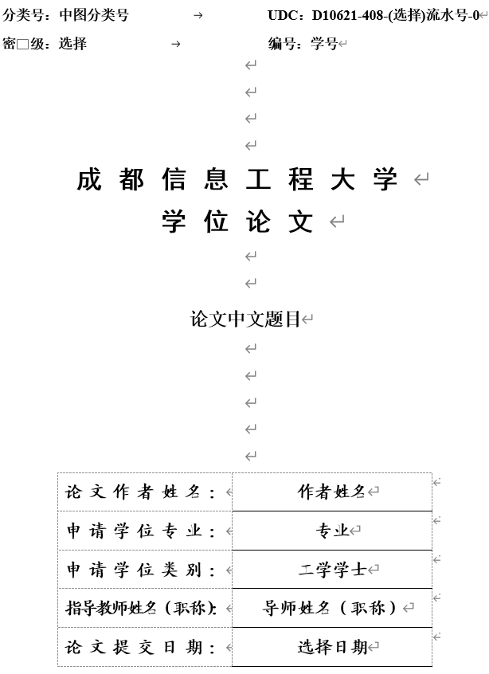
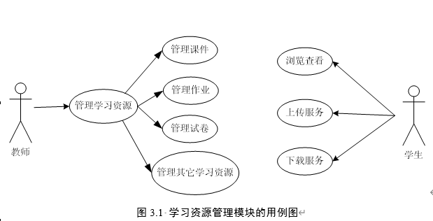
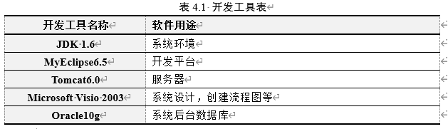

# 成都信息工程大学硕士学位论文模版

## 简介

本项目通过规范论文中的样式，并简化一些复杂操作，希望帮助学生提高毕业论文撰写效率。目前，仅支持在 Word 上的使用，已经 Word 2021 上测试可以正常执行。

## 论文模版使用说明

### 获取模板

- 从版本库上下载

  目前，可以从 Github 和 Gitee 上免费获得该模版。在工程的 Release 目录下，有该模板的最新版本。

  https://github.com/sk8boy/cuit_dissertation_template
  https://gitee.com/tiejunwang/cuit_dissertation_template

- 从模板菜单中获取

  若你已经拥有模板，可以直接在 Word 的菜单 “毕业论文” 页面，找到 “获取更新” 下拉菜单，从中选择一个版本库连接进行下载。

  

### 论文模板样式说明

模版根据《（2025 年版）中文硕士学位论文模板》和《（2025 年版）中文硕士学位论文格式范例》两个文件，定义了如下样式。


其中，“论文”开始的样式为自定义样式，用户可在撰写论文时直接选用。此外，图中“AMDisplayEquation”和“AMEquationSection”两个样式，是安装并使用了 AxMath（公式编辑器，可替代 MathType，价格上有优势）之后添加的样式。

### 推荐第三方工具

为了便于论文撰写，建议安装公式编辑器和参考文献工具。

- 公式编辑器，推荐安装国产工具 [AxMath](https://www.amyxun.com/)，功能上和 MathType 相仿，价格上有明显优势。

- 参考文献工具，推荐使用 [Zotero](https://www.zotero.org/)，完全免费。对于参考文献引用、更新、格式设置均较友好。参考文献引用的样式，可直接使用“GB/T 7714-2015（顺序编码，双语）”，符合毕业论文的样式要求。

### 使用论文模板

作者可以通过以下两种方式使用模版。

1. 全新开始撰写学位论文

   若作者在开始撰写学位论文前就拿到了该模版，是最方便上手的情况。此时，在确保使用了最新版本后，可以通过双击模版文件（成都信息工程大学硕士学位论文模版 vX.X.X.dotm），使用 Word 程序创建一个新的学位论文文件。

   此时，可以参考下面的 “菜单使用” 说明，全新撰写一篇学位论文。

2. 学位论文已经写了好多

   如果你已经开始着手写论文，或者毕业论文已经将近完成，此时可通过下面方法应用该模版。

   - 使用 Word 打开毕业论文文件。

   - 通过 Word 的 “文件 - 选项” 功能，打开如下所示的 “Word 选项” 窗口。在该窗口中，选择 “加载项” 页面， 在 “管理” 的下拉列表中选择 “模版” 选项，单击 “转到” 按钮。

   

   - 接下来，在打开的 “模版和加载项” 窗口中，默认情况下下，作者对论文应该使用的是 “Normal” 模版。此时，单击 “选用” 按钮，在弹出窗口中选中活动的该模板。单击 “确定” 按钮，关闭 “模版与加载项” 窗口。此时，该模版将应用到了作者的论文中。

   

   - 最后，打开 “毕业论文” 选项卡，单击 “模版检查恢复” 按钮，在作者的论文中创建必要的样式。

   注意，这种情况下，因为论文中没有插入模版中控件，因此 “论文基础信息” 和 “更新正文页数” 功能将无法正常使用。若要使用该功能，需要从模板中将 首页、原创新声明页、中英文摘要页、目录页 插入到现在的论文中后，才能正常使用。

### 菜单使用

为了方便，将常用的功能集成到了 Word 的菜单上，分为 模板工具、题注相关、样式设置和模板相关四个功能区。

1.  填写基础信息

    为了规范论文封面（下图），一些基础信息设置成了控件，规范了样式，并且有些设置为不可直接编辑。

    

    为此，建议在首次打开模版时，通过菜单中 “论文基础信息” 按钮，打开基础信息填写窗口。

    

    填写上必要信息后，单击 “确定” 按钮可实现内容自动更新。

    对于封面上不需要的信息，如“其他导师”的导师姓名、职称控件可进行删除。

    基础信息填写后，下次打开将会提取之前填写的信息，方便后续进行作者进行更新，包括论文的中英文题目。

    这些基础性将会多次出现论文的不同地方。例如，在原创性声明页面，会替换模板中的 “论文中文题目” 和 “导师姓名”。

    

    中英文摘要页面，论文的中英文题目将会替换 “学位论文中文题目” 和 “Disserattion in English” 内容。

2.  更新正文页数

    在论文中，正文页数定义为从 “第一章” 开始到 “致谢” 结束的页数。论文中有两个地方涉及到正文页数。一个是目录页上的 “论文总页数” 标记。

    

    另一个是论文正文中页脚的 “共 XX 页”。

    

    当点击 “更新正文页数” 按钮后，会弹出如下窗口，提示输入第一章的标题。默认情况下，是 “绪论”。当作者更改了论文第一章标题后，需要在输入框中输入正确的第一章标题。单击 “确定” 按钮后将统计正文页数，提示结果，并对上述两个引用了正文页数的标签进行更新。

    

3.  删除多余空格

    当从网页或其他程序中拷贝内容到论文后，有时会在中英文直接、或者两个中文字符间插入额外的空格。此时，可选中需要清楚空格的段落文字，单击该按钮，可清楚多余空格。

    注意：本功能不会删除英文字符间的空格，因此不用担心将英文内容的样式弄乱。

4.  插入图片和图编号

    图题需要出现的图片下发。首先，需要插入图片，并在样式列表中选择 “论文图” 样式。

    换行后，在图片下方为图键入标题。然后，将光标定位到图题开始处，单击 “插入图编号” 按钮。模板将会根据所在章节，自动生成 “图章节编号-图号 ” 样式的图编号。

    

5.  插入表和表编号

    表题需要出现在表格上方。所以，首先将光标定位在新行中，并单击按钮 “插入表编号”，让后在编号后方键入表题。此外，页可以先键入表题，然后将光标移动到表题开始处，单击按钮 “插入表编号” 完成表题编写。

    

    插入表题后，另起一行，可根据需要插入表格。选中插入的表格，在 “表格样式” 中选择模板自带的 “三线表” 样式。并根据需要，在左边的 “表格样式选项” 中选择，表格是否包含标题行、第一列等信息。

    

    在表格中插入文字后，可选中整个表格，在样式列表中应用 “论文表格文字”，统一字体和段落样式。然后，在根据需要，调整对其。

6.  插入算法

    模版提供的算法包括算法名称、输入、输出、伪代码四个部分。若需要在论文中插入算法，可单击 “插入算法” 按钮。此时，模版将自动插入一个带编号的算法模板，如下图所示。

    

    之后，可在算法编号后面键入标题，并在表格中键入相应内容。作者也可以根据需要，自行对算法表格进行调整。

7.  插入数学证明相关的题注

    为了描述一下数学问题，论文中可能会用到 定义、定理、引理、推论、问题等题注。通过单击相应的按钮，可完成相关内容插入，如下图所示。

    

8.  插入交叉引用

    上面 4 - 7 小节插入的编号项目，在 Word 中均被定义为 “题注”。若需要在正文中对上述插入的题注进行引用，可使用 “插入交叉引用” 功能。

    使用该功能，需要单击两次 “插入交叉引用” 按钮。

    - 首先，需要将光标定位到正文中需要插入 “交叉引用” 的位置，然后单击该按钮。

    - 然后，将光标定位到需要引用的题注上，例如 “图 3-1”、“定义 2-3”、“算法 4-1”等位置，最后在第二次单击该按钮，完成交叉引用的插入。

    插入交叉引用后，当题注的编号有更新时，只需要按 “F9” 功能键，就可完成相关引用的更新。

9.  样式设置

    - 标题样式

      定义了 1 ~ 6 级标题，若要应用标题样式，将光标定位到标题文字上方，单击该按钮后，可自动设定样式。其中，标题序号格式为 “第一章”、“1.1”、“1.1.1”。标题序号自动编号，不行键入。

      论文的目录会根据标题自动生成，生成时默认只有前三级标题会显示在目录中。

    - 列表样式

      为了方便使用，模板定义了 “无序列表”、“有序列表”和“无缩序号” 三种形式的列表，如下图所示。

      

            - 无序列表： 以 实心原点 为开头，后面文字自动缩进对齐。

            - 有序列表： 以 "1." "2." 形式开头，自动编号，后面文字自动缩进对齐。

            - 无缩序号： 以 “(1)” “(2)” 形式开头，自动编号，后面文字保留 “论文正文” 样式，会被缩进。

      以上三种列表形式，作者可根据实际需要进行选则。通过选中相应的文字段落，单击对应的按钮，可完成列表样式设置。

      上述三个列表，实际上都是 “多级列表”，可以通过单击 “提升级别” 和 “降低级别” 按钮，对列表的级别进行修改。对于 “无序列表”，提升和较低级别，将影响开头的符号和缩进量；对于其他列表，将会影响开头的编号和缩进量。

      对于 “有序列表” 和 “无缩序号”，将光标定位到需要修改编号顺序的段落,然后单击 “切换序号” 按钮，实现在 “连续编号” 和 “重新开始编号” 直接进行切换。

    - 论文正文

      选中需要应用 “论文正文” 样式的文字，单击 “论文正文” 按钮，可将选中文字的样式修改为论文正文。也可以在选中文字后，在样式列表中选中 “论文正文” 样式进行使用。

    - 源代码

      选中需要应用 “论文程序代码” 样式的文字，单击 “论文正文” 按钮，可将选中文字的样式修改为论文正文。也可以在选中文字后，在样式列表中选中 “论文程序代码” 样式进行使用。

      

10. 模版项目

    当作者对模板中自定义代码进行了修改，或者因为带格式粘贴其他文字内容后，使得模板中自定义样式发生了变化，可通过单击 “模版检查恢复” 按钮，对自定义样式进行恢复。

    同时，该功能还将恢复文件的 “页面设置” 参数，包括页面大小、页边距、装订线等设置。

## 开发说明

如果你希望在本项目工作基础上，继续进行二次开发或贡献，可以参考下面说明搭建开发环境。

### 工程目录结构和文件说明

```
├───Build.ps1                   # 构建工程的主脚本，使用 PowerShell 实现
├───LICENSE                     # 本项目使用 GPL v3 的开源协议
├───makeVBAProjectFile.py       # 构建工程的次脚本，使用 Python 实现，用来生成
│                               # vbaProject.bin 的 VBA 工程文件
├───README.md                   # 说明文件
├───requirements.txt            # makeVBAProjectFile.py 所依赖的库
├───Version.txt                 # 记录当前发布的版本号
├───Documents                   # 模板相关文档目录，包括学校的规范和相关说明图片。其
│                               # 下的 cuit_dissertation_template.dotm 文件不能删除
├───Release                     # 模板发布目录，该目录下有一个基础模板文件
└───Source                      # 工程源代码目录
    ├───CustomUI                # Ribbon 所依赖文件目录，可通过RibbonX Editor打开
    │   │   customUI14.xml      # Word 生成自定义选项卡的定义文件
    │   ├───images              # 所有选项卡上按钮所需的自定义的图标文件
    │   └───_rels               # Ribbon 所需的关联文件
    └───VBAProject              # 所有在 Word 中定义的 VBA 宏功能定义目录
        ├───BaseInfoForm.frm    # 论文基础信息弹窗
        ├───BaseInfoForm.frx    # 论文基础信息弹窗
        ├───CUITMacro.bas       # 主要 VBA 宏定义的模块文件
        ├───ThisDocument.cls    # 每个 Word 文件自带的 VBA 类文件
        └───vbaProject.bin      # 将前面4个文件打包后生成的 VBA 项目文件
```

### 构建项目

本项目使用了 PowerShell 和 Python 两个脚本系统进行构建。其中，PowerShell 使用的是 5.1 版本，Python 使用的是 3.12 版本。

1.  开发环境

    - 建议使用 [Visual Studio Code](https://code.visualstudio.com/download) 作为主体开发工具，进行版本管理和代码编程。在 VS Code 中编辑 VBA 代码，建议安装 VBA 和 VBS Formatter 两个插件。
    - 建议使用 [PyCharm](https://www.jetbrains.com/pycharm/download/?section=windows) 作为 Python IDE 对部署脚本（makeVBAProjectFile.py）进行修改。注意，需要首先安装 requirements.txt 中的依赖包。（PyCharm 可以通过学校的邮箱申请教育版的免费使用）
    - 使用 Word 自带的 Microsoft Visual Basic for Applications 对 VB 代码进行开发和调试。
    - 使用 [Office RibbonX Editor](https://github.com/fernandreu/office-ribbonx-editor) 对自定义选项卡进行设计开发。可参考微软的[这篇文章](https://learn.microsoft.com/en-us/office/vba/library-reference/concepts/customize-the-office-fluent-ribbon-by-using-an-open-xml-formats-file)学习基本的定制化方法。
    - （选用）使用 [HxD](https://mh-nexus.de/en/hxd/) 查看文件内容，当出现文件编码格式错误时可以使用。

2.  文件编码要求

    - 默认情况下，项目中的源文件采用 UTF-8（无 BOM）进行编码。
    - CUITMacro.bas：该文件必须采用 GBK 编码。否则在导入 Word 后，中文会出现乱码。
    - Build.ps1：该文件必须采用 utf8bom （UTF-8 带 BOM） 编码，否则终端上输出的中文将会是乱码。

3.  构建工程

    在 VS Code 的终端上，执行一下命令，可对工程进行发布。

        .\Build.ps1 -CleanBeforeBuild

    其中，可根据需要确定是否使用 “-CleanBeforeBuild” 选项。

4.  工程构建过程

    - 将 Documents/cuit_dissertation_template.dotm 文件解压到 Windows 的临时目录(可在资源管理器地址栏中输入 %TEMP% 快速访问)，在临时目录下创建 WordTemplateBuild 目录对工程进行构建。
    - 添加 CustomUI 组件。将 Source/CustomUI 目录下的内容，复制到 WordTemplateBuild\cuit_dissertation_template.dotm 目录下，替换原有的自定义选项卡内容。
    - 构建 VBA 组件。通过 makeVBAProjectFile.py 脚本，借助 win32com.client 库构建一个临时的 Word 文件（temp.docm），并将 Source/VBAProject 下的 4 个文件添加到该文件中。最后从临时文件中析出 vbaProject.bin 文件，保存到 Source/VBAProject 目录下。
    - 添加 VBA 组件。将 Source/VBAProject/vbaProject.bin 文件添加到 WordTemplateBuild\cuit_dissertation_template.dotm\word 目录，替换原有的 VBA 工程文件。
    - 创建新的 Dotm 文件。在 Windows 临时目录下，将 WordTemplateBuild\cuit_dissertation_template.dotm 重新构建（压缩成 ZIP 文件）成一个 Word 模板文件，并在文件名称后加上新发布的版本号。

    理解上述构建过程，对后续问题跟踪和错误调试都有帮助。

### VB 代码的开发与调试

1.  打开 Word 的开发工具选项卡。

    通过 Word 的 “文件 - 选项” 功能，打开如下所示的 “Word 选项” 窗口。在该窗口中，在左侧选择 “自定义功能区” 页面， 在 右侧的 “主选项卡” 下选中 “开发工具” 选项，单击 “确定” 按钮。

    

    此时，将在 Word 的主选项卡上增加 “开发工具” 功能。在其下的 “代码” 组中单击 “Visual Basic” 按钮，可以打开自带的 Microsoft Visual Basic for Applications 应用，对模板中的 VB 代码进行编辑。

2.  调试 VB 代码

    此时，在 Microsoft Visual Basic for Applications 中编辑的 VB 源代码，和 Source\VBAProject 中的 TisDocument.cls、CUITMacro.bas 和 BaseInfoForm.frm 中的代码是相同的。

    可以和其他开发语言的 IDE 一样，在 VB 代码中设置断点、监视器等方式，进行跟踪和调试。注意，若需要最终在工程中生效，需要将修改调试正确的代码，复制一份到本工程中，才能最终发布。否则，只会对当前打开正在使用的学位论文模板才有效。

3.  编码时的约定

    本项目中的 VB 代码，遵循如下约定：

    - 对于直接被自定义选项卡上按钮调用的 Sub，统一声明为 Public，函数名称以 \_RibbonFun 结尾。
    - 对于被其他方法调用的函数，声明为 Private。
    - 所有直接被按钮调用的函数，主体操作需要添加到 Word 的 Undo 堆栈中。通过下面代码实现：

            ' 开始 UndoRecord
            Set ur = Application.UndoRecord
            ur.StartCustomRecord "应用XXX操作"

            ' 添加需要的操作序列

            ' 结束操作，关闭 UndoRecord
            Application.ScreenRefresh
            ur.EndCustomRecord

## 致谢

本模版的开发灵感来源于 [Springer](https://www.springer.com/gp/computer-science/lncs/conference-proceedings-guidelines) 发布的会议论文模板 [Microsoft Word Proceedings Templates](https://resource-cms.springernature.com/springer-cms/rest/v1/content/19238706/data/v5) ，使得我从中了解并开始学习如何在 Word 中加入自定义的 Ribbon 选项卡，以及如何基于 VBA 制作 Word 模板的宝贵经验。

开发过程中，还参考借鉴了 Github 上的另外两个开源项目：

- [InsertCrossReferencesComfortably：](https://github.com/boar24/InsertCrossReferencesComfortably)基于该项目，实现了插入交叉引用功能。该项目中提供了丰富的功能，包括插入章节、页码、书签等功能，本模版开发中仅使用了插入 图编号和表编号 的功能。

- [HandyRefVBA：](https://github.com/shishouyuan/HandyRefVBA)借鉴了该项目中的经验，实现了模板中 “关于” 和 “获取更新” 两个菜单。同时，该项目页实现了一种不同的插入交叉引用方式，单考虑到 AxMath 和 MathType 插入引用时的使用习惯，最终选用了前面一种实现方式。

## 有用的链接

- 微软官方的 Word VB 开发文档
  https://learn.microsoft.com/en-us/office/vba/api/overview/word

- Office 自带的选项卡图标
  https://bert-toolkit.com/imagemso-list.html

- 微软官方关于 VBA 项目文件格式规范
  https://learn.microsoft.com/en-us/openspecs/office_file_formats/ms-ovba/575462ba-bf67-4190-9fac-c275523c75fc
